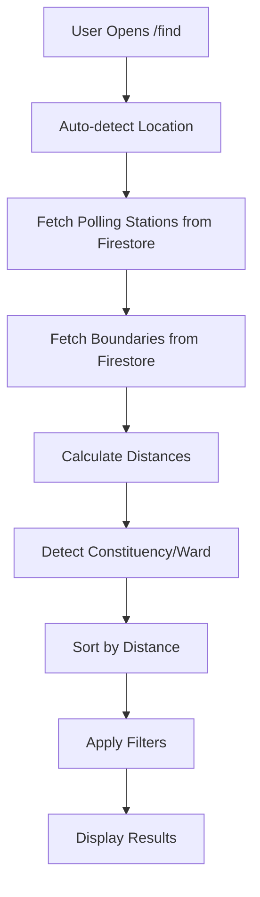

# Kenya Polling Stations - Real Data Implementation Guide

This guide explains how the app has been upgraded to use **real Kenyan polling station data** from official sources instead of hardcoded sample data.

## 🎯 What Changed

### Before
- 5 hardcoded sample polling stations
- No filtering by constituency/ward
- No distance calculation
- No boundary detection

### After
- **24,000+ real polling stations** from IEBC/Kenya election data
- **Real-time distance calculation** using Haversine formula
- **Automatic constituency/ward detection** based on user location
- **Advanced filtering** by constituency, ward, and search
- **Map clustering** for efficient rendering of thousands of markers
- **Sorted by distance** when user location is available

## 📁 New Files Created

### 1. Geospatial Utilities (`src/lib/geospatial.ts`)
Contains helper functions for:
- Distance calculation (Haversine formula)
- Sorting stations by distance
- Filtering by radius
- Point-in-polygon detection for constituency/ward
- Distance formatting

### 2. Custom Hooks

#### `src/hooks/use-polling-stations.ts`
- Fetches polling stations from Firestore
- Filters by distance, constituency, ward
- Sorts by proximity to user
- Returns loading/error states

#### `src/hooks/use-boundaries.ts`
- Fetches constituency and ward boundaries
- Provides point-in-polygon detection
- Auto-detects user's constituency/ward

### 3. Upload Scripts

#### `scripts/upload-election-data.ts`
Node.js script to upload GeoJSON data to Firestore:
- Uploads polling stations to `/pollingStations` collection
- Uploads constituencies to `/constituencies` collection
- Uploads wards to `/wards` collection
- Handles batching (500 docs per batch)
- Progress logging

#### `scripts/download-sample-data.sh`
Bash script to download sample data from GitHub

### 4. Documentation
- `scripts/README.md` - Data import guide
- This file (`IMPLEMENTATION.md`) - Complete implementation guide

## 📊 Data Structure

### Firestore Collections

#### `/pollingStations/{id}`
```typescript
{
  id: string;
  name: string;                    // "Karura Primary School"
  constituency: string;            // "Westlands"
  ward: string;                    // "Parklands/Highridge"
  coordinates: {
    lat: number;                   // -1.2662
    lng: number;                   // 36.8043
  };
  type: string;                    // "registration" or "polling"
  operatingHours: string;          // "08:00 AM - 05:00 PM (Mon-Fri)"
  metadata: {                      // Preserved from original data
    imported: string;              // ISO timestamp
    [key: string]: any;
  }
}
```

#### `/constituencies/{id}`
```typescript
{
  id: string;
  name: string;                    // "Westlands"
  code: string;                    // "047"
  geometry: {
    type: "Polygon" | "MultiPolygon";
    coordinates: number[][][];     // GeoJSON polygon
  };
  metadata: object;
}
```

#### `/wards/{id}`
```typescript
{
  id: string;
  name: string;                    // "Parklands/Highridge"
  constituency: string;            // "Westlands"
  code: string;                    // "047001"
  geometry: {
    type: "Polygon" | "MultiPolygon";
    coordinates: number[][][];
  };
  metadata: object;
}
```

## 🚀 How to Import Real Data

### Step 1: Download Data

```bash
# Option A: Run automated script
./scripts/download-sample-data.sh

# Option B: Manual download
# Visit: https://github.com/mikelmaron/kenya-election-data
# Download polling-stations.geojson from /output/polling
```

For constituencies and wards:
1. Visit: https://data.humdata.org/dataset/kenya-elections
2. Download Admin Level 2 (Constituencies) as GeoJSON
3. Download Admin Level 3 (Wards) as GeoJSON
4. Save to `/data` directory

### Step 2: Convert Shapefiles (if needed)

If you downloaded shapefiles instead of GeoJSON:

```bash
# Install GDAL
brew install gdal  # macOS
# or
sudo apt-get install gdal-bin  # Ubuntu

# Convert to GeoJSON
ogr2ogr -f GeoJSON -t_srs EPSG:4326 \
  data/polling-stations.geojson \
  polling-stations.shp

ogr2ogr -f GeoJSON -t_srs EPSG:4326 \
  data/constituencies.geojson \
  constituencies.shp

ogr2ogr -f GeoJSON -t_srs EPSG:4326 \
  data/wards.geojson \
  wards.shp
```

Or use online tools:
- https://mapshaper.org/
- https://mygeodata.cloud/converter/shp-to-geojson

### Step 3: Set up Firebase Admin

1. Go to Firebase Console → Project Settings → Service Accounts
2. Click "Generate New Private Key"
3. Save as `service-account-key.json` in project root
4. **Add to .gitignore!**

```bash
# Set environment variable
export GOOGLE_APPLICATION_CREDENTIALS="./service-account-key.json"
```

### Step 4: Install Dependencies

```bash
npm install --save-dev firebase-admin tsx
```

### Step 5: Upload Data

```bash
npx tsx scripts/upload-election-data.ts
```

Expected output:
```
🇰🇪 Kenya Election Data Upload Script
=====================================

📍 Uploading Polling Stations...
  ✓ Uploaded 500 stations...
  ✓ Uploaded 1000 stations...
  ...
  ✅ Uploaded 24,123 polling stations

🏛️  Uploading Constituencies...
  ✅ Uploaded 290 constituencies

🏘️  Uploading Wards...
  ✓ Uploaded 500 wards...
  ...
  ✅ Uploaded 1,450 wards

✅ Upload complete!
```

### Step 6: Verify in Firebase Console

1. Go to Firebase Console → Firestore Database
2. Check collections: `pollingStations`, `constituencies`, `wards`
3. Verify document structure and counts

## 🎨 Frontend Features

### Updated `/find` Page

1. **Loading States**
   - Shows spinner while fetching data
   - "Loading polling stations..." message

2. **Constituency Detection Banner**
   - Automatically detects user's constituency
   - Shows at top of page: "Your Constituency: Westlands"

3. **Advanced Filters**
   - **Search**: Filter by name, constituency, or ward
   - **Constituency dropdown**: Select specific constituency
   - **Ward dropdown**: Appears after selecting constituency
   - **Clear Filters button**: Reset all filters
   - **Active filter badges**: Visual indication of applied filters

4. **Distance Display**
   - Cards show distance badge (e.g., "2.3km")
   - Map popups show distance
   - Sorted by proximity (nearest first)

5. **Map Clustering**
   - Uses `react-leaflet-cluster`
   - Groups nearby markers for performance
   - Expands on zoom/click
   - Handles 24k+ markers smoothly

### Updated Components

#### `InteractiveMap.tsx`
- Added `MarkerClusterGroup` for efficient rendering
- Shows distance in popups
- Displays constituency and ward in popup

#### `VoterCenterCard.tsx`
- Added distance badge with pin icon
- Styled to match existing design

## 🔧 How It Works

### Data Flow



### Distance Calculation

Uses the Haversine formula to calculate great-circle distance:

```typescript
const R = 6371; // Earth's radius in km
const dLat = toRad(lat2 - lat1);
const dLng = toRad(lng2 - lng1);

const a = Math.sin(dLat/2) * Math.sin(dLat/2) +
          Math.cos(toRad(lat1)) * Math.cos(toRad(lat2)) *
          Math.sin(dLng/2) * Math.sin(dLng/2);

const c = 2 * Math.atan2(Math.sqrt(a), Math.sqrt(1-a));
const distance = R * c; // in kilometers
```

### Constituency Detection

Uses ray-casting algorithm for point-in-polygon detection:

1. Load constituency polygons from Firestore
2. For user's GPS coordinates, test each polygon
3. If point is inside polygon, user is in that constituency
4. Display constituency name in banner

### Performance Optimizations

1. **Firestore Query Limits**
   - Default: 1000 stations max
   - Filtered by distance (50km radius default)

2. **Map Clustering**
   - Groups markers within 50px radius
   - Reduces DOM elements
   - Smooth performance with 24k+ markers

3. **Lazy Loading**
   - Map component dynamically imported (SSR disabled)
   - Boundaries loaded separately
   - No blocking on initial page load

4. **Memoization**
   - Filter results memoized with `useMemo`
   - Constituencies/wards lists cached
   - Reduces re-renders

## 📦 New Dependencies

```json
{
  "dependencies": {
    "react-leaflet-cluster": "^2.1.0"
  },
  "devDependencies": {
    "firebase-admin": "^12.0.0",
    "tsx": "^4.7.0"
  }
}
```

## 🔐 Security (Already Configured)

Firestore rules already in place (`firestore.rules`):

```javascript
// Public read access to polling data
match /pollingStations/{id} {
  allow get, list: if true;
  allow write: if false; // Only admin
}

match /constituencies/{id} {
  allow get, list: if true;
  allow write: if false;
}

match /wards/{id} {
  allow get, list: if true;
  allow write: if false;
}
```

## 🧪 Testing the Implementation

### 1. Test with Sample Data (5 Stations)

The app will continue to work with hardcoded data until you upload real data. To test:

```bash
npm run dev
# Visit http://localhost:9002/find
# Should see 5 sample stations
```

### 2. Test with Real Data

After uploading data:

```bash
# Clear browser cache
# Refresh the page
# Should see:
# - "Showing X centers near you" (X > 5)
# - Distance badges on cards
# - Constituency detection banner
# - Filter dropdowns with real constituencies
```

### 3. Test Filters

1. **Search**: Type "Westlands" → Should filter stations
2. **Constituency**: Select "Westlands" → Show only Westlands stations
3. **Ward**: After selecting constituency, select a ward
4. **Clear**: Click "Clear Filters" → Reset to all stations

### 4. Test Map

1. **Clustering**: Zoom out → Markers group into clusters
2. **Zoom in**: Clusters expand to individual markers
3. **Click marker**: Should show popup with distance
4. **User location**: Red marker shows your GPS location

## 🐛 Troubleshooting

### No data showing

**Problem**: "Showing 0 centers"

**Solutions**:
1. Check Firestore data was uploaded
2. Check browser console for errors
3. Verify Firebase config is correct
4. Check network tab for Firestore requests

### Distance not showing

**Problem**: Cards/map don't show distance

**Solutions**:
1. Check user location permission granted
2. Verify `usePollingStations` hook receives `userLocation`
3. Check `sortByDistance` is being called

### Constituency not detected

**Problem**: No "Your Constituency" banner

**Solutions**:
1. Verify boundaries uploaded to Firestore
2. Check user location is within Kenya
3. Verify point-in-polygon logic in `geospatial.ts`

### Map markers not clustering

**Problem**: All markers show individually

**Solutions**:
1. Verify `react-leaflet-cluster` is installed
2. Check `MarkerClusterGroup` wraps markers
3. Try zooming out further

### Upload script fails

**Problem**: `npx tsx scripts/upload-election-data.ts` errors

**Solutions**:
```bash
# Check Firebase Admin SDK key
ls service-account-key.json

# Verify environment variable
echo $GOOGLE_APPLICATION_CREDENTIALS

# Check data files exist
ls -la data/

# Install dependencies
npm install --save-dev firebase-admin tsx

# Try with explicit path
GOOGLE_APPLICATION_CREDENTIALS=./service-account-key.json \
  npx tsx scripts/upload-election-data.ts
```

## 📚 Data Sources

Official sources used:

1. **Polling Stations**
   - Mike Maron's Kenya Election Data: https://github.com/mikelmaron/kenya-election-data
   - Contains ~24,000 polling stations with coordinates

2. **Constituencies & Wards**
   - Humanitarian Data Exchange (HDX): https://data.humdata.org/dataset/kenya-elections
   - Official IEBC boundaries

3. **Alternative Sources**
   - IEBC Official: https://www.iebc.or.ke/
   - Kenya Open Data: https://kenya.opendataforafrica.org/

## 🎓 Further Enhancements

Potential future improvements:

1. **Geohash Indexing**
   - Add geohash field to documents
   - Enable geo-queries in Firestore
   - Faster proximity searches

2. **Caching**
   - Use IndexedDB for offline access
   - Cache boundaries client-side
   - Reduce Firestore reads

3. **Search Autocomplete**
   - Algolia integration
   - Full-text search on station names

4. **Advanced Routing**
   - Integrate Google Maps Directions API
   - Show actual travel routes

5. **Real-time Updates**
   - Use Firestore real-time listeners
   - Live station status updates

## 📞 Support

For issues:
1. Check this guide first
2. Review `scripts/README.md`
3. Check browser console errors
4. Verify Firestore data structure

---

**Built for Mwanzo Vote Locator 🇰🇪**
*Empowering Kenyan voters with real-time polling station data*
